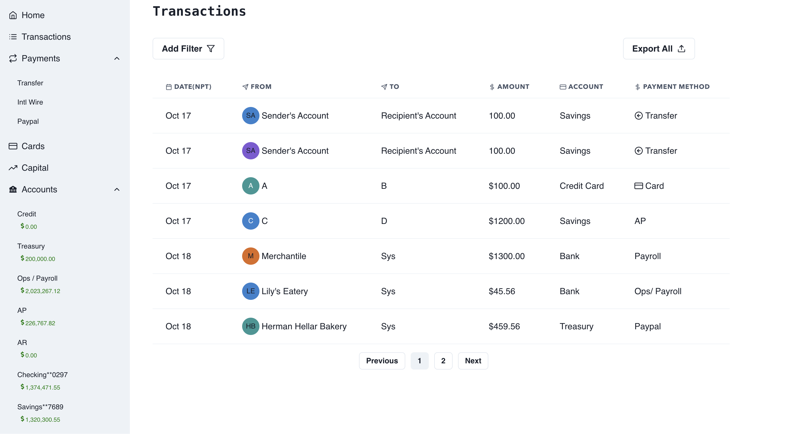

### Transaction Dashboard 📦✨
#### Full Stack Single Page Application to show list of trasactions on a Dashboard.



## Overview 📋
This project leverages CRUD concepts in the `Golang`, `ReactJs`, and `MySQL` tech stack to fetch data from database and visualize them on a Dashboard. 
## Prerequisites 🛠️
Before you embark on this adventure, ensure you have the following tools installed on your system:
- Golang
- ReactJS⚛️
- npm or yarn 📦
- Database( MySQl) 🔄

## 1. Getting Project Up and Running 📦
With GitHub SSH configured on your machine:
```
# Clone the repository
git clone https://github.com/arbinydv/transaction-management-app.git
```

### 2. Getting the project up and running  🚀
  Ensure that your MySQL database is properly configured and a database is created.

#### Running Project  🏃
 * Backend 
    ``` 
    cd server 
    ```
 *  Starting the App
    ``` 
    go run main.go  # runs the app at port 4000
    ```
  *  Database Connection and Navigation (MySQL)
      ``` 
          CREATE database trasactions; #create database

          Connect to database 

          Migrate the data
      ```
  * Frontend 
    ```
    cd client
    ```
  * Install dependencies
    ```
    npm install || yarn install 
    ```
  *  Start development server
      ``` 
     yarn dev  # runs the app at port 3000 and connect backend app at 4000
      ```
 Now, your project is up and running at http://localhost:3000 🌐
#### 3. Dashboard Navigation
* Dashboard for Transaction  📦🗂️
  ``` 
    localhost:3000/dashboard
  ```
* LandingPage 🔄🛍️
  ```
    localhost:3000
  ```
